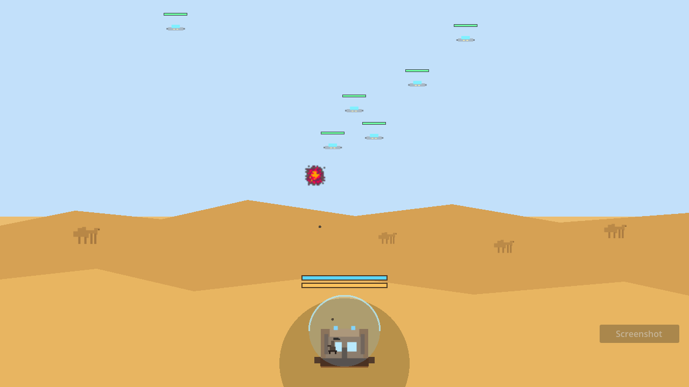

# Stratidle

2D idle/strategy game prototype built with Godot 4.

## Game Concept

The player defends a base represented by a small building at the bottom center of the screen, protected by a dome and placed on a desert plain.

The base defense is split into two layers:

- a dome with 1000 starting hit points;
- a house with 100 hit points underneath the dome.

When the dome reaches 0, further damage hits the house. The run is lost when the house reaches 0.

Foundational prototype rules:

- the game is a 2D game;
- the base is fixed at the bottom center of the screen;
- camels move erratically in the background;
- the game is structured into 11 levels;
- each level contains 10 waves;
- waves in a given level always have the same characteristics from one run to another;
- waves in a given level keep the same timing and enemy composition from one run to another, but enemy spawn origins vary between runs;
- each wave lasts 30 seconds;
- the wave number affects enemy spawn frequency;
- wave 1 spawns one enemy per second;
- wave 10 spawns one enemy every 0.2 seconds;
- at the end of each wave, the player chooses one irreversible upgrade from all available upgrades across the three arsenals;
- if the player loses a run, it is `GAME OVER` and everything restarts from the beginning;
- victory consists of fully completing level 11.

## Arsenals

The player has three arsenals:

- machine gun;
- missiles;
- electromagnetic wave.

The player always starts with the level 1 machine gun.

Arsenal base values:

- machine gun: 4.68 damage, 3 shots per second;
- missiles: 14.04 damage, 1 shot every 3 seconds;
- electromagnetic wave: 4.68 damage, 1 shot every 3 seconds.

Orientation:

- the machine gun and missiles have a rotation speed;
- this speed is not an upgrade choice;
- it increases automatically with the game level.

At the end of each wave, all upgrade choices are offered for all three arsenals. Each arsenal can evolve through:

- its number of elements, up to a maximum of 10;
- its shot power, with +10% projectile size and +10% projectile speed per level;
- its fire rate, with +20% per level.

Upgrade presentation:

- count upgrades display the progression `x/10 -> y/10`;
- power and fire rate upgrades display the stat level, from `0 -> n`.
- extra arsenal copies beyond the first appear as additional ground mounts placed randomly around the dome.

Power and fire rate apply to the total number of elements in the relevant arsenal.

## Enemies And Waves

Alien invaders arrive in waves with four minimum classes:

- small saucers: weak enemies;
- cruisers: medium enemies;
- flagships: strong enemies;
- bosses: very powerful giant flying octopuses.

Current behaviors:

- saucers position themselves above the dome and then deal 1 damage per second with a 30-degree conical beam, completed by 4 visual rings;
- some enemies can spawn from far away in the sky, first scaling up from 0 to full size before switching to their normal path toward the dome;
- if a saucer enters attack range above a camel, it can absorb it by invoking its conical beam, visually double in size, and multiply all its stats by 2;
- absorbed camels do not return during the current wave, but the next wave starts again with all camels present;
- cruisers move erratically farther away and fire 3-damage lasers;
- flagships launch small ships that crash into the dome every 5 seconds for 10 damage;
- the boss descends to the dome, latches onto it, and deals 10 damage per second with its tentacles.

Each enemy exposes at least the following characteristics:

- health;
- armor;
- speed;
- fire rate;
- shot power.

The current level affects enemy statistics, notably health, armor, speed, and firepower.

## Score And Leaderboard

Two measures coexist:

- a combat score earned during the run;
- a total time used for the leaderboard.

Combat score:

- +1 point each time an enemy is hit;
- +10 x enemy rank when it is destroyed;
- ranks: saucer = 1, cruiser = 2, flagship = 3, boss = 5.
- the combat score is also displayed at the top center during combat.

The final ranking remains based on the total time required to complete all 11 levels.

The local leaderboard:

- stores the best times;
- sorts scores from the smallest time to the largest;
- is saved to a local file via `user://leaderboard.json`;
- requires a 3-letter name entry on victory before saving.

## Technical Base

The project uses Godot 4 as its main engine.

Current structure:

- `project.godot`: main project configuration;
- `scenes/main/main.tscn`: main scene with HUD;
- `scripts/main.gd`: root coordinator for state transitions, wave flow, and world rendering;
- `scripts/audio_manager.gd`: autoloaded audio/settings manager for music and sound playback;
- `scripts/combat_controller.gd`, `scripts/upgrade_controller.gd`, `scripts/hud_controller.gd`: focused runtime controllers;
- `scripts/screenshot_manager.gd`, `scripts/arsenal_layout.gd`, `scripts/combat_support.gd`, `scripts/combat_effects.gd`: utility helpers;
- `scripts/arsenal.gd`, `scripts/wave_data.gd`, `scripts/upgrade_option.gd`: typed `RefCounted` gameplay data objects;
- `scripts/camel_entity.gd`: runtime `Node2D` camel entity;
- `scripts/enemy_entity.gd`, `scripts/projectile_entity.gd`, `scripts/explosion_entity.gd`: `Node2D` runtime entities;
- `scripts/enemy.gd`, `scripts/wave_manager.gd`, `scripts/leaderboard.gd`, `scripts/settings_store.gd`, `scripts/enums.gd`, `scripts/game_config.gd`: shared gameplay data, config, enums, and persistence helpers.

## Prototype Status

The current prototype includes:

- a 2D desert setting with integrated local sprites for camels, the base, arsenals, and enemies;
- a base under a dome at the bottom center of the screen;
- ambient camels in motion;
- waves of individual enemies with minimum statistics;
- deterministic progression across 11 x 10 waves;
- a complete grid of irreversible upgrades at the end of each wave, with arsenal icons;
- combat feedback with animated enemy-destruction explosions, a red flash on the dome when under attack, and an explosion on the house when it takes damage;
- explosion sounds and distinct trigger sounds for the machine gun, missiles, and electromagnetic wave;
- a camel groan sound when a saucer absorbs a camel;
- a definitive defeat condition;
- a victory condition with local score recording.

## Launch

Open the project folder in Godot, then launch the default configured main scene.

Launch interface:

- `Commencer une run` is only visible on the home screen;
- `Recommencer` is visible outside the home screen to restart a new attempt.
